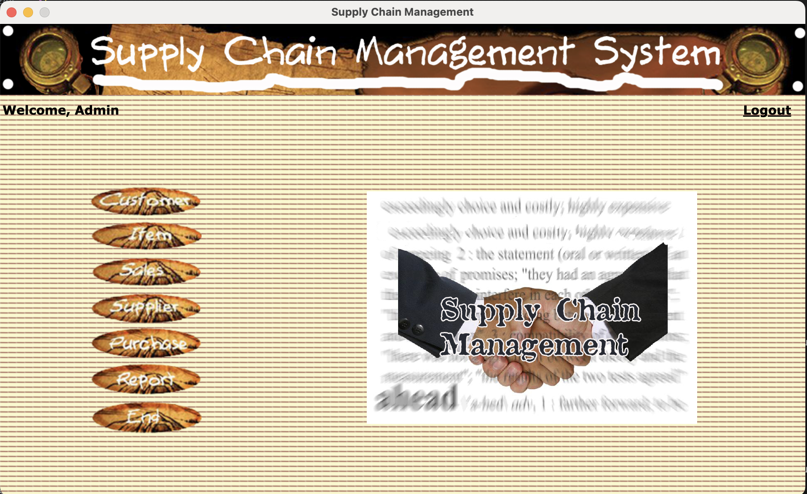
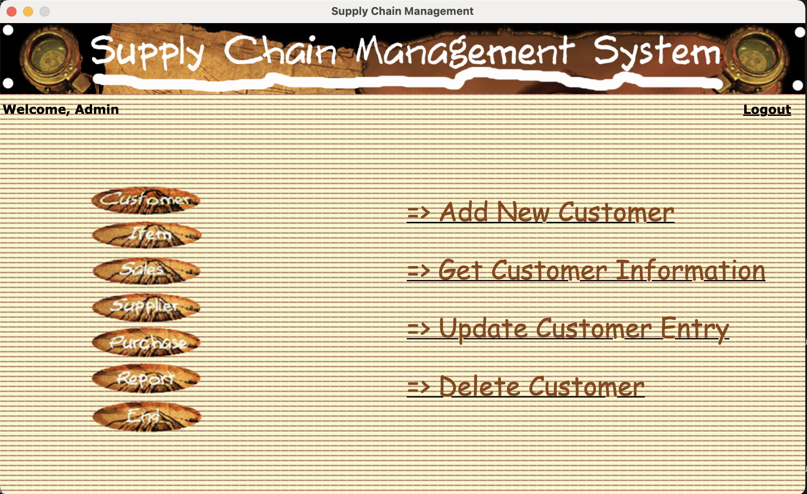
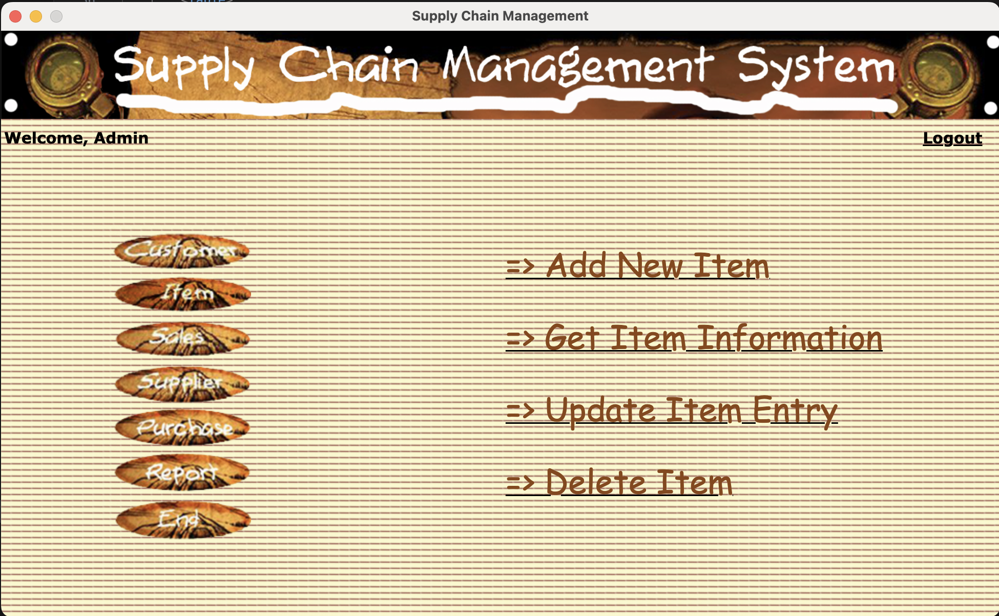
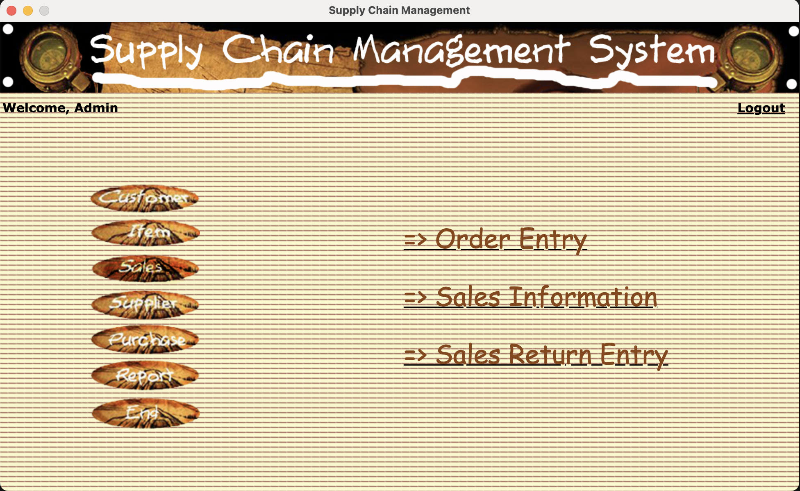
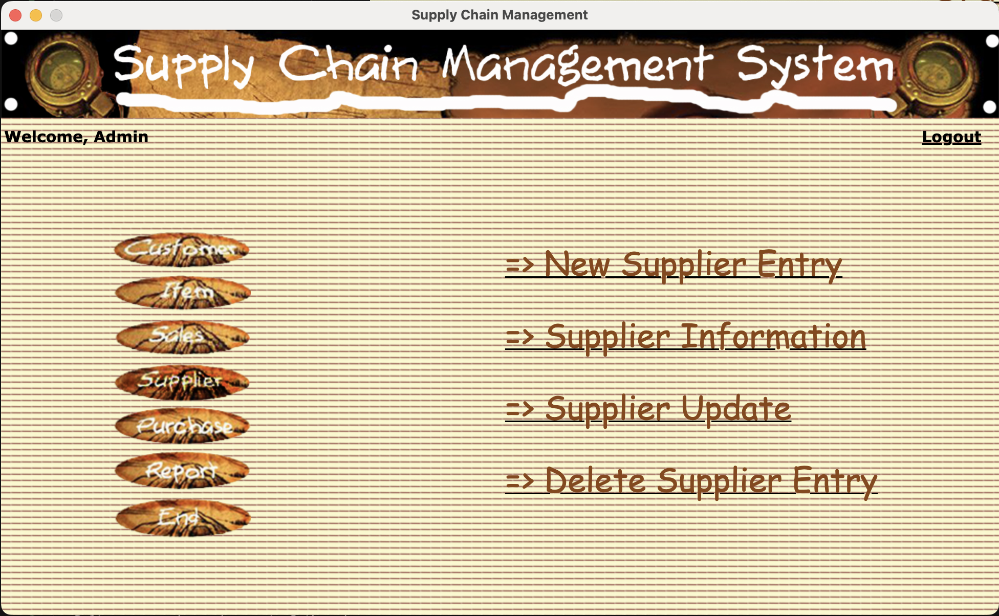
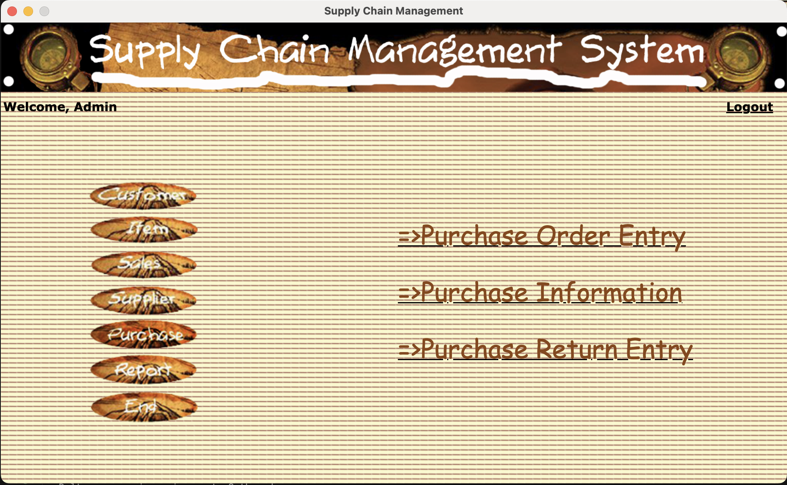
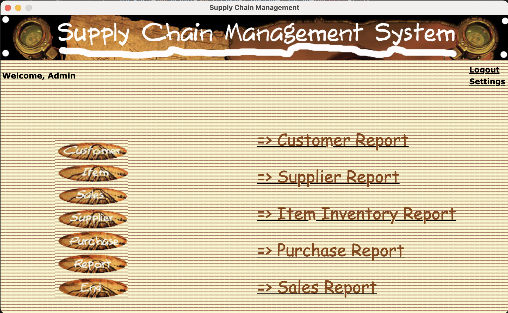

# Supply Chain Management System

A Supply Chain Management (SCM) system is a comprehensive set of tools, processes, and technologies designed to manage and optimize the entire flow of goods, information, and finances as they move from the supplier to the manufacturer, through various distribution channels, and ultimately to the end customer. The primary goal of a supply chain management system is to improve efficiency, reduce costs, and enhance overall customer satisfaction.

Key components and features of a typical supply chain management system include:

1. **Planning and Forecasting:**

   - Demand Planning: Anticipating customer demand to ensure the right amount of products are produced or stocked.
   - Supply Planning: Coordinating production and procurement activities to meet demand.
2. **Sourcing and Procurement:**

   - Supplier Management: Identifying and managing relationships with suppliers.
   - Procurement: Ordering and acquiring raw materials, components, and products.
3. **Production and Manufacturing:**

   - Production Planning: Scheduling and managing manufacturing processes.
   - Quality Management: Ensuring product quality throughout the production process.
4. **Inventory Management:**

   - Stock Control: Optimizing inventory levels to prevent shortages or excess stock.
   - Warehousing: Efficient storage and handling of goods.
5. **Logistics and Distribution:**

   - Transportation Management: Planning and optimizing the movement of goods.
   - Distribution Network: Managing the network of warehouses and distribution centers.
6. **Information Systems and Technology:**

   - Integration: Connecting and integrating various systems and technologies for seamless information flow.
   - Data Analytics: Using data to gain insights into supply chain performance and make informed decisions.
7. **Demand Fulfillment:**

   - Order Processing: Managing customer orders and ensuring timely fulfillment.
   - Last-Mile Delivery: Optimizing the final leg of the delivery process to the end customer.
8. **Visibility and Collaboration:**

   - Real-time Tracking: Monitoring the movement of goods throughout the supply chain.
   - Collaboration Tools: Facilitating communication and collaboration among supply chain partners.
9. **Risk Management:**

   - Identifying and mitigating potential risks that could disrupt the supply chain.
   - Contingency Planning: Developing plans to address unforeseen events or disruptions.
10. **Environmental Sustainability:**

    - Implementing practices and strategies to minimize the environmental impact of the supply chain.

Implementing an effective supply chain management system can lead to benefits such as cost reduction, improved efficiency, faster response to market changes, enhanced customer satisfaction, and better overall competitiveness in the marketplace. Advanced technologies like blockchain, artificial intelligence, and the Internet of Things (IoT) are increasingly being integrated into SCM systems to further enhance their capabilities.

## About

This version is rearchietctured for node-electron using sqlite database with intergration with[ BestBooks ™Accounting Application Framework.](https://github.com/pingleware/bestbooks-helpers)

the Customer management panel,

the Items panel,

the Sales panel,

the Supplier panel,

the Purchase panel,

the Report panel,

